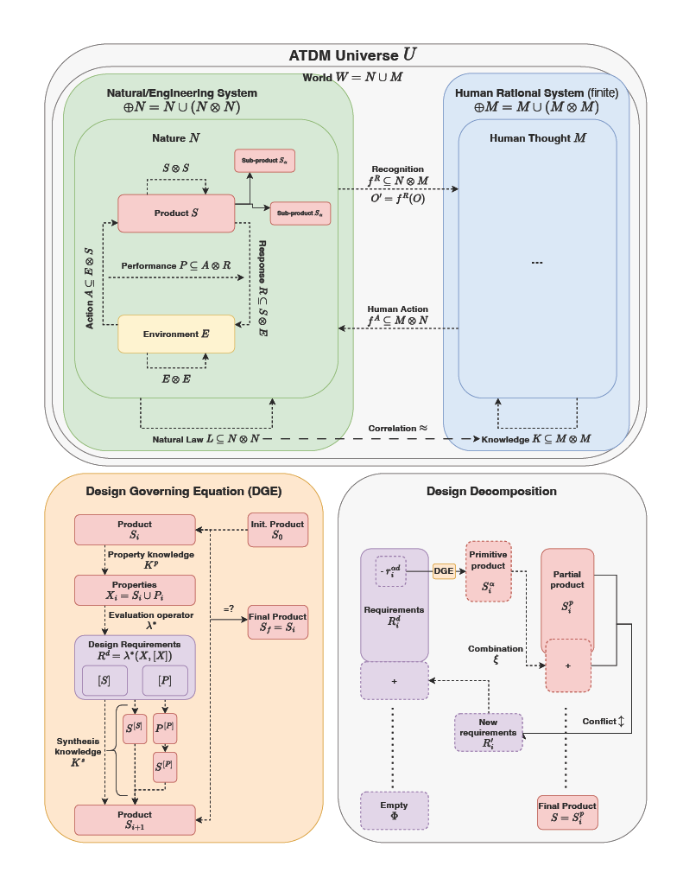

# Axiomatic Theory of Design Modelling

*Model of the universe as based on Zeng's theory. Diagram by me.*

The original article by Zeng can be found here: [atdm.pdf](atdm.pdf)

## Lean Proofs
My formalization of ATDM is found in [atdm.lean](./formalization/atdm.lean).

## Software Implementation
My implementation of ATDM is found in [atdm.py](./soft/atdm.py). My guide can be read in [atdm-guide.md](./soft/atdm-guide.md). Example usage can be found in [main.py](./soft/main.py).

**scrap**: contains draft work
